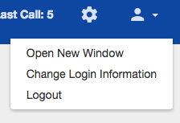

# Component Name:  UserMenu   #
# 1. Functional Description #

The UserMenu component displays a user icon. When clicked, the user icon displays a menu containing a list of actions. When the actions are clicked, they carry out a specific task.

# 3. Visual Design #  

  

# 4. Component Type #

This component will be a 'pure' component.

## a. Required Props ##

| Prop Name | Sample | Description |
| ------------ | ------------- | ------------- |
| compStyle |  _NOTE styles are in JSX, not CSX_  { inputWrapStyle:   {backgroundColor: '#ddd'}  inputStyle {fontSize: '1rem'}  } |  Optional prop. If value is provided, then it will render new styles, if not it will render default styling. |

## b. Component State ##

This component will maintain it's own state for dropdownDisplayed.

## c .Component Events ##
(REMOVE WHEN DONE)

If the component needs to react to events (clicks, key presses, etc.) then those events should be listed here along with the action that should be taken:

Sample:

| Event | Action(s) |
| ------------ | ------------- |
| userMenu icon clicked | 1 . dropdownDisplayed state is toggled.|

## d. Context-Aware Specification ##

This component is a pure component and it will maintain it’s own state for presentational purposes.

# 5. Reference Components #

The component to be developed requires the following components:

- VertoBaseComponent
- svgIcons
- react-intl

# 6. Unit Testing Requirement #

Tests for this component are located at:

        src/tests/userMenu-test.js
